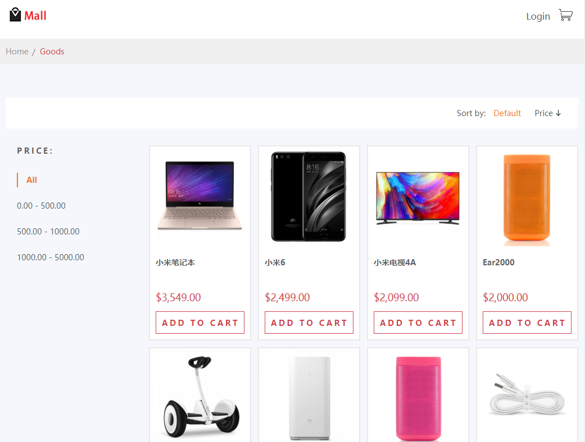
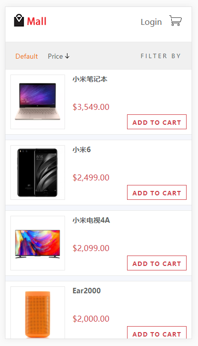

# mall

> A fucking simple and ugly online mall built with Vue.js, Node, MongoDB.

Live demo at [http://mall.demo.kwl.im/](http://mall.demo.kwl.im/)

Username: admin  
Password: 123456





## Build Setup

``` bash
# install dependencies
npm install

# serve with hot reload at localhost:8080
npm run dev

# build for production with minification
npm run build

# build for production and view the bundle analyzer report
npm run build --report
```

